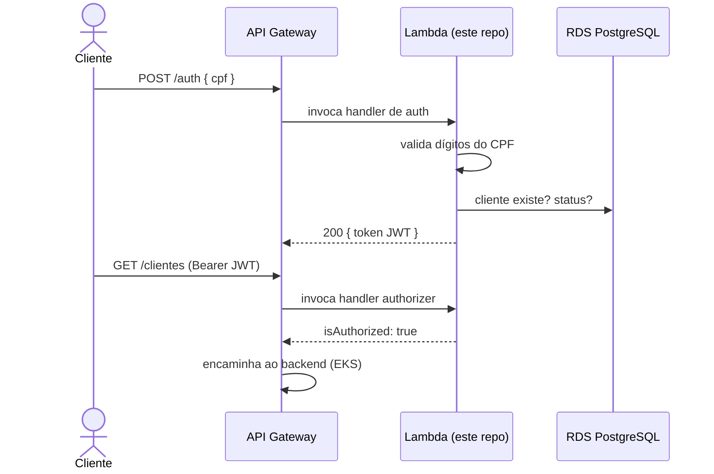

# soat-fiap-oficina-auth-lambda

Function serverless de **autenticação por CPF** do Sistema da Oficina Mecânica
(Tech Challenge FIAP — Fase 3). Único emissor de JWT da solução: roda como
**AWS Lambda** atrás do API Gateway e é também o **Lambda Authorizer** que
valida o token nas rotas protegidas. Repositório **1/4** da solução.

| # | Repositório | Conteúdo |
|---|---|---|
| 1 | **soat-fiap-oficina-auth-lambda** (este) | Function serverless de autenticação por CPF |
| 2 | [soat-fiap-oficina-infra-k8s](https://github.com/guilhermeqmaia/soat-fiap-oficina-infra-k8s) | Terraform do API Gateway + cluster EKS |
| 3 | [soat-fiap-oficina-infra-db](https://github.com/guilhermeqmaia/soat-fiap-oficina-infra-db) | Terraform do banco gerenciado (RDS PostgreSQL) |
| 4 | [soat-fiap-oficina-mecanica-app](https://github.com/guilhermeqmaia/soat-fiap-oficina-mecanica-app) | Aplicação NestJS + manifestos K8s + docs |

> **Status:** scaffold — a implementação é a
> [US-F3-01](docs/user-stories/f3-01-serverless-cpf-auth.md). O gateway que a
> invoca já existe
> ([soat-fiap-oficina-infra-k8s/gateway](https://github.com/guilhermeqmaia/soat-fiap-oficina-infra-k8s/tree/main/gateway)).

## Contrato

Uma única function com dois papéis:

### 1. Autenticação — `POST /auth` (via API Gateway)

| Cenário | Resposta |
|---|---|
| Cliente: `{ "cpf": "..." }` válido, cliente ativo na base | `200 { "token": "<JWT>" }` |
| Staff: `{ "cpf": "...", "senha": "..." }` (CPF validado e associado ao usuário) | `200 { "token": "<JWT>" }` |
| CPF com dígitos verificadores inválidos | `422` |
| Cliente/usuário inexistente | `404` |
| Cliente inativo/bloqueado ou senha incorreta | `403` |

Claims do JWT: `sub` (id), `cpf`, `role`, `iss`, `exp` — assinado (HS256) com
segredo compartilhado com o monólito via **AWS Secrets Manager**.

> A regra de negócio (sancionada pelo professor no fórum): a validação do CPF
> deve fazer parte do fluxo, mas credenciais com senha são permitidas desde que
> o CPF esteja validado e associado ao usuário — é assim que o staff
> (ADMIN/ATENDENTE/MECANICO/ESTOQUISTA) se autentica.

### 2. Lambda Authorizer (rotas protegidas do gateway)

Handler dedicado invocado pelo API Gateway (payload **2.0**, *simple
responses*): recebe o header `Authorization: Bearer <JWT>`, valida
assinatura/`iss`/`exp` e responde `{ "isAuthorized": true|false }`. Cache de
resultado no gateway: 300s por token.

## Fluxo

## Tecnologias

- **AWS Lambda** (Node.js 22 / TypeScript)
- **Amazon RDS PostgreSQL** (consulta de clientes — repo 3)
- **AWS Secrets Manager** (segredo de assinatura do JWT)
- Testes unitários (validação de CPF, emissão de JWT, cenários de status) +
  teste de contrato do payload do token

## Credenciais e segredos

- Nada de credencial commitada: deploy usa **GitHub Actions Secrets**
  (`AWS_ACCESS_KEY_ID`, `AWS_SECRET_ACCESS_KEY`, `AWS_SESSION_TOKEN` — AWS
  Academy, token renovado por sessão do lab).
- O segredo do JWT vive no **AWS Secrets Manager**, lido em runtime.

## Documentação

- [docs/user-stories/](docs/user-stories/) — US-F3-01 (esta function), US-F3-02
  (gateway) e US-F3-03 (monólito como resource server)
- [docs/tech-challenges/fase-3-tech-challenge.pdf](docs/tech-challenges/fase-3-tech-challenge.pdf) — enunciado
- [docs/qa-plans/](docs/qa-plans/) — planos de QA (gerados com a skill `/qa-plan`)
